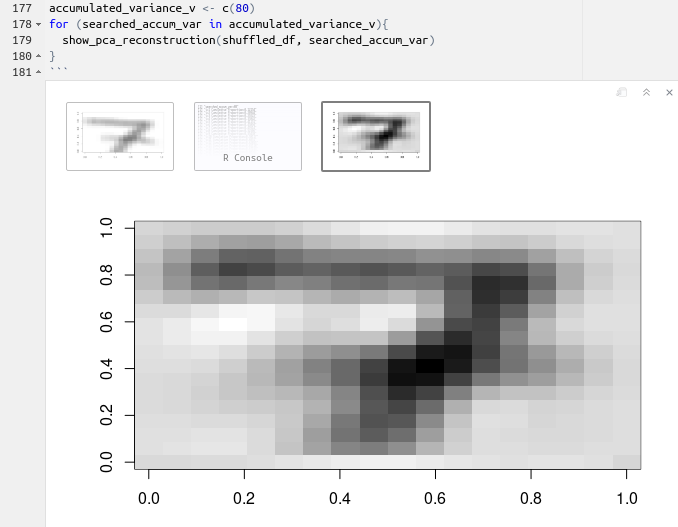
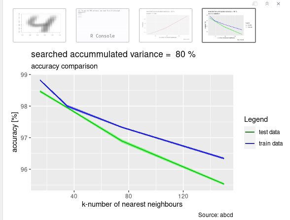

# Exercise 2 - PCA

## Our opinions on the exercise / plan how to solve it / what was already used - what's new.

FOUND a SAVIOUR thanks to Ines!
https://github.com/LennartOlsen/pca-digits/blob/master/main.r

OK reconstruction has just worked!

Plots need fixing!

TODO: 

- compare test and train data accuracy on 1 plot [DONE]

- UPGRADE TO NEW DATA - check if it works there too

- only individual 2.1 made -> need also ALL PERSONS IN in and DISJUNCT

- CROSS VALIDATION and NORMALIZATION

- PREPROCESSING and CV

- RECONSTRUCTION

## Exercise 2.1: Principal Component Analysis (PCA)
Here we in general will need to do kNN with the PCA-based dimensionality reduction
	check the performance - time and maybe also accuracy?
	
Zouchi's comments:
use https://www.rdocumentation.org/packages/stats/versions/3.6.2/topics/prcomp
	
sdev - its a square root of eigenvalues of covariance matrix, it's the loading that we will talk about. To get the score of eigenvalue we should calculate sdev^2.
	
rotation - we can get eigenvectors from columns
	
x - value of rotated data. We can use it directly for our training. Data already projected to the new coordinates of principle components. Every row is one sample - one cipher ( one image ). Every column is projection to principle component. 1st column is original dataset projected to the 1st principal component - 2nd column is dataset projected on the 2nd principle component.
	
Then he goes to explaining normalization and next steps

Actually I haven't really followed his instructions - maybe would be cool if we can use summary(pca) instead of calculations but nevertheless even change shouldn't be that hard

TODO:
## Exercise 2.2: Normalization
min-max normalization and z-standarization - Norbert says we have to do only 1 method!
also do then knn with 10 fold cross-validation.

TODO:
## Exercise 2.3: Preprocessing
applying smoothing to the images and cross validation

TODO:
## Exercise 2.4: Reconstruction using PCA
plotting eigenvectors as images
Maybe 2.4.3 will be difficult
how to re-recreate -> checking how data size was reduced etc

